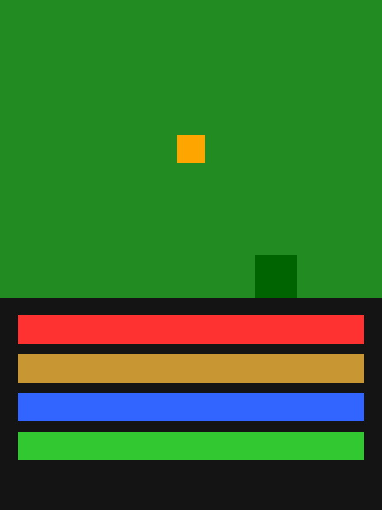

# craftax.cu

CUDA reimplementation of [Craftax-Classic](https://github.com/MichaelTMatworthy/Craftax) (Matthews et al. 2024) for high-throughput RL training.

The idea: take the fastest PufferLib environment and see how far you can get by keeping everything on GPU and writing the game logic in pure CUDA. Turns out, pretty far.

<p align="center">
  
</p>

## Results

All numbers on a single RTX 3090. Same PPO hyperparameters, same 64-unit MLP policy.

| | JAX (Craftax) | CUDA (this repo) | Speedup |
|---|---:|---:|---:|
| **Env-only SPS** (4096 envs) | ~300k | 1.4M | 4.7x |
| **Env-only SPS** (32k envs) | OOM | 7.8M | - |
| **Training SPS** (matched hparams) | 107k | 796k | **7.4x** |
| **Wall time for 10M steps** | 93s | 12.5s | **7.4x** |
| **Final mean return** | 4.76 | 5.48 | same |

Both implementations converge to the same reward, confirming correctness. 33/33 validation tests pass against a JAX reference trajectory.

## Install

Requires an NVIDIA GPU and a CUDA toolkit version that matches your PyTorch install.

```bash
git clone https://github.com/Infatoshi/craftax.cu.git
cd craftax.cu
uv sync
```

If you get a CUDA version mismatch during the build, install a PyTorch version matching your system CUDA toolkit:

```bash
# Example: system has CUDA 12.8
uv venv && uv pip install torch --index-url https://download.pytorch.org/whl/cu128
uv pip install --no-build-isolation -e .
```

Check your CUDA toolkit version with `nvcc --version` and match it to a [PyTorch wheel](https://pytorch.org/get-started/locally/).

## Usage

```python
import torch
import craftax_cuda

env = craftax_cuda.CraftaxEnv(num_envs=4096, seed=42)
obs = env.reset()                    # (4096, 1345) float32 on GPU
actions = torch.randint(0, 17, (4096,), dtype=torch.int32, device='cuda')
obs, rewards, dones = env.step(actions)
```

### Benchmark

```bash
uv run bench.py                          # env-only + PPO training
uv run bench.py --num-envs 32768 --num-steps 32 --update-epochs 1  # max throughput
uv run bench.py --env-only               # env kernel only
```

### Validate

```bash
uv run validate.py    # 33 tests against JAX reference
```

## Architecture

Everything lives on GPU. No CPU-GPU copies in the hot path.

- **`craftax.cuh`** -- `EnvState` struct (2.3 KB/env), 4-bit packed map, device helpers
- **`craftax.cu`** -- Game logic: Perlin noise worldgen, crafting, combat, mob AI, intrinsics, observation construction
- **`craftax_ext.cu`** -- PyTorch C++ extension (pybind11). Exposes `CraftaxEnv` with `reset()` and `step()`

Key design choices:
- **4-bit packed map**: 64x64 map in 2048 bytes instead of 4096
- **Split step/autoreset kernels**: Perlin noise worldgen only runs on done envs, preventing warp stall
- **Compact mob storage**: Struct-of-arrays for positions, no 64x64 mob map
- **Per-env RNG**: `curandStatePhilox4_32_10_t` baked into each `EnvState`

The PPO training loop is pure PyTorch. The main optimization insight: with a tiny MLP (64 hidden units), PyTorch eager mode beats `torch.compile` because the compile overhead dominates. Scaling to 32k-65k envs amortizes the per-step kernel launch overhead.

## What is Craftax-Classic?

A procedurally generated survival game used as an RL benchmark. The agent spawns on a 64x64 tile map with resources, mobs, and crafting. 17 actions (move, mine, craft, place, sleep), 22 achievements to unlock. Episodes run for 10k timesteps. The observation is a 7x9 local view + inventory + stats = 1345-dim vector.

Originally implemented in JAX by [Matthews et al.](https://github.com/MichaelTMatworthy/Craftax) for fully-GPU training with `jax.lax.scan`. This repo replaces the JAX env kernel with CUDA while keeping PyTorch for the training loop.

## File structure

```
craftax.cuh          # Constants, EnvState struct, device helpers (233 lines)
craftax.cu           # Full game logic + CUDA kernels (722 lines)
craftax_ext.cu       # PyTorch C++ extension binding (108 lines)
setup.py             # Build config (auto-detects GPU arch)
bench.py             # Benchmark script
validate.py          # 33-test validation suite
gen_reference.py     # Generates JAX reference data
reference_data.npz   # JAX reference trajectory (seed=42, 100 steps)
render_gif.py        # Train agent + render gameplay GIF
```

## Citation

If you use this in your work:

```bibtex
@software{craftax_cuda,
  title={craftax.cu: CUDA Craftax-Classic},
  url={https://github.com/Infatoshi/craftax.cu},
  year={2025}
}
```

The original Craftax environment:

```bibtex
@inproceedings{matthews2024craftax,
  title={Craftax: A Lightning-Fast Benchmark for Open-Ended Reinforcement Learning},
  author={Michael Matthews and Michael Beukman and Benjamin Ellis and Mikayel Samvelyan and Matthew Jackson and Samuel Coward and Jakob Foerster},
  booktitle={International Conference on Machine Learning},
  year={2024}
}
```
